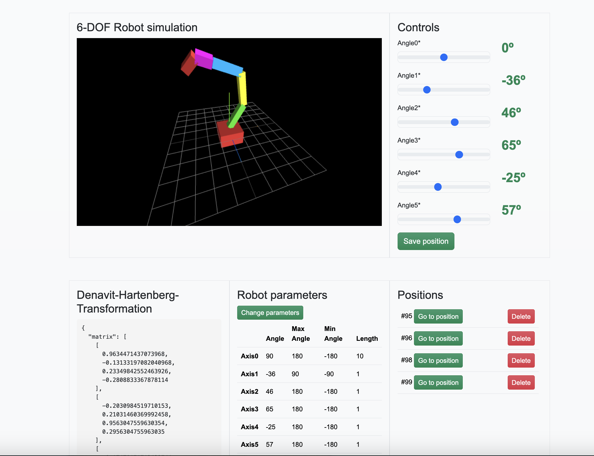

# 6-Dof Robot Simulator



#### A simple 6-axis robot simulator. Built with python and Django on the backend, HTMX, HTML with Bootstrap for styling and THREE.js for displaying the robot.


## Features

## How to run

You must have Docker installed.

Clone this code repository:
```
https://github.com/fbzyx/6dof-robot-simulator.git
```

Go to the root folder **6dof-robot-simulator/** and run the following command:

```
docker compose up
```

After Docker has finished creating the container and it is running, go to http://127.0.0.1:8000/.

## How to run tests

First, in the root directory (**6dof-robot-simulator/**) create and activate a virtual environment:
```
python -m venv venv 
source venv/bin/activate
```
You should now have a virtual environment in a venv folder inside the **6dof-robot-simulator/** folder.

Go inside the **robot_ui/** folder:
```
cd robot_ui
```
Next, install the project requirements:
```
cd robot_ui
pip install -r requirements.txt 
```
Finally, execute the following command to run the teste (from the **robot_ui/** folder):
```
python manage.py test
```